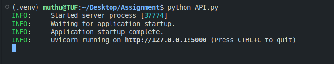
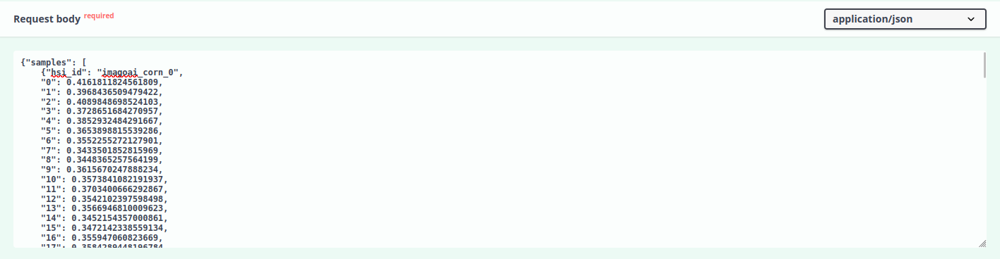
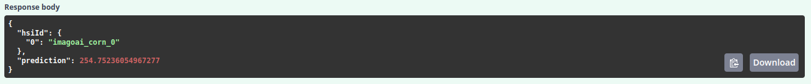

# Toxin Predictor

## Instruction
1. Install any latest python version 
2. Install library dependencies with the following command

```bash
pip install -r requirements.txt

```

3. Simply run `python API.py` in CLI (Linux environment)

4. Structure your input body like the following:

```json
{
    "samples": [
        {"hsi_id": a, "0": 0.304, ...., "447": 0.223}
    ]
}
```
5. You can send prediction request by visiting `http://127.0.0.1:5000/docs#/default/predict_predict_post` after running `API.py`.
6. Once prediction completed, you would see output like the following:

 
